# Agile Service Manager GIS Map Plugin
Open source project to provide geographical mapping with [IBM Agile Service Manager](https://www.ibm.com/support/knowledgecenter/SS9LQB_1.1.7/welcome_page/kc_welcome-444.html) using [OpenStreetMap](https://www.openstreetmap.org/about) and [Leaflet.js](https://leafletjs.com/)

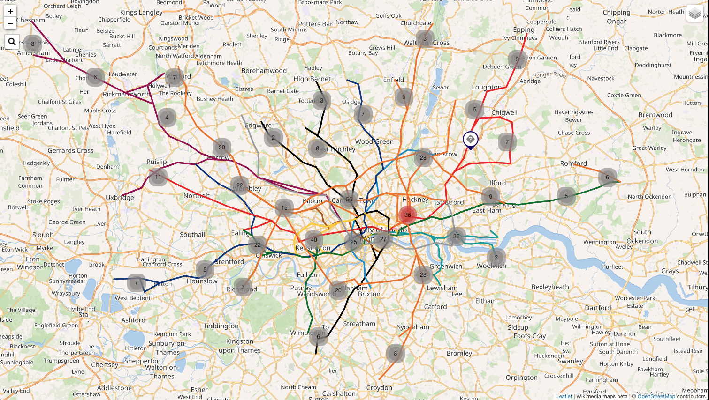

## Contents
- [Agile Service Manager GIS Map Plugin](#agile-service-manager-gis-map-plugin)
  - [Contents](#contents)
  - [Using Agile Service Manager GIS Map Plugin](#using-agile-service-manager-gis-map-plugin)
    - [Example ASM resource](#example-asm-resource)
    - [Example docker-compose.yaml extract](#example-docker-composeyaml-extract)
- [Building & Running](#building--running)
  - [Building](#building)
  - [Running with Node.js](#running-with-nodejs)
  - [Running on Docker](#running-on-docker)
    - [Building Docker image](#building-docker-image)
  - [Running Docker](#running-docker)
- [Using the mapper](#using-the-mapper)
  - [Default page](#default-page)
  - [URL options](#url-options)
  - [Using mapper with ASM](#using-mapper-with-asm)
    - [Create DASH mapper page](#create-dash-mapper-page)
    - [Create mapper launch tool in ASM](#create-mapper-launch-tool-in-asm)
- [Features](#features)
  - [Location markers](#location-markers)
  - [Tooltip](#tooltip)
  - [Info popup table](#info-popup-table)
  - [Search](#search)
  - [Layer filtering](#Layer-filtering)
  - [Relationship links](#relationship-links)
  - [Geo Boundary](#geo-boundary)
  - [Affected radius](#affected-radius)
  - [Weather layers](#Weather-layers)


## Using Agile Service Manager GIS Map Plugin
Having a geographical map of resource locations, their relationships and state helps operations teams quickly identify the cause and impact of problems with their environment. This is a Node.js project that displays a geographical map having obtained data from ASM's topology service. It can be run directly using Node or a docker image can be run, with a docker-compose configuration. 

This app queries ASM for a set of specified resource types with the specified latitude and longitude properties and then displays and their locations as markers on the map. For example, if your servers have latitude and longitude properties, then the app can display the locations of your servers. 

Below is an example of an ASM resource that inludes location information as 'lat' and 'long' properties. To display this location, the app needs to be configured to query ASM for resources of type 'businessLocation' and to use 'lat' and 'long' as location properties. This can either be set in the [docker-compose.yml](docker-compose.yml) file if using docker, or in the `config.yaml` file found in `src/etc/config.yml`. Note that multiple location types and location properties can be configured if you need to display more than one type of location. 

#### Example ASM resource
```
{
  "uniqueId": "woking_ibm",
  "name": "IBM Woking",
  "entityTypes": [
    "businessLocation"
  ],
  "long": "-0.559018",
  "lat": "51.320676"
}
```


#### Example docker-compose.yaml extract
```
LOCATION_TYPES: location,businessLocation
```

## Building & Running
The app can be run directly with Node.js or a Docker image can be built and run using docker-compose.

### Building
For both methods you will need to build the app the same way.
```
cd <project_root_dir>
npm install
npm run build
```

### Running with Node.js
To start the app, make sure you have updated the configuration in [src/etc/config.yml](src/etc/config.yml), then run the following commands after following the [Building](#Building) step.
```
cd <project_root_dir>
npm start
```
This will start the application and you will see console log output indicating the configuration used to start the app and the ports it is running on.

### Running on Docker
The latest version of the app is available to download for Dockerhub and start using immediate. To do this jump straight to [Running Docker](#Running-Docker).

#### Building Docker image
To build the docker image first follow the instructions in the [Building](#Building) step. Then run the following commands.
```
cd <project_root_dir>
docker image build . -t agile-service-manager-gis-map-plugin:latest
```

This will create the new Docker image `agile-service-manager-gis-map-plugin`. To use this image follow the instructions in the [Running Docker](#Running-Docker) step.


### Running Docker
Running the docker image, requires using the image from Dockerhub or a locally built image from step [Building Docker image](#Building-Docker-image).

This project includes an example [docker-compose.yml](docker-compose.yml) file which can be used with [docker-compose](https://docs.docker.com/compose/) to run the image with the required configuration. Before you run the image make sure that you modify the values of the [docker-compose.yml](docker-compose.yml) to match your systems requirements. The file includes full documentation of each of the configuration options, if you don't provide a value a default will be used.

If you are running the Dockerhub image you will need to modify the file to replace the image name that is used. You can comment out the local image name and use the Dockerhub path.
Example
```
version: '2.1'
services:
  ui:
    # image: agile-service-manager-gis-map-plugin:latest
    image: <docker-reg-host>/agile-service-manager-gis-map-plugin:latest
```

Once you have made all the required configuration changes run the following command to start the ASM topology mapper app.

```
docker-compose up -d
```


## Using the mapper

### Default page
If you open up the mapper page with no URL parameters, it will pull all of the specified locations from ASM and display them. This will be based on the configuration settings used to configure the app.

### URL options
If you want to modify the default behaviour of the app, you can use the following URL options in combination to change the map output.

- hideLinks [boolean]: doesn't draw links on map
- hideGeoBoundary [boolean]: doesn't draw geoBoundaries on map
- hideAffectedRadius [boolean]: doesn't draw affected radius areas with markers on the map
- returnComposites [boolean]: pull composite resources from ASM default true
- updateRate [number]: The poll interval for the page in milliseconds
- initialViewLocation [string]: Initial map center location on load
- initialZoomLevel [number]: Initial map zoom level on load
- resourceId [String]: Enables a launch to a specific marker on the map using the ASM resource id
- groupIds [comma separated list]: List of groupIds to use for locations, overrides the configured location type requests
- locationTypes [comma separated list]: List of entityTypes to use for locations, overrides the configured value
- geoBoundaryTypes [comma separated list]: List of entityTypes to use for geoBoundaries, overrides the configured value
- locationLinkTypes [comma separated list]: List of relationshipTypes to draw, overrides the configured value
- locationLimit [number]: Max number of location points to pull
- tooltipProperties[comma separated list]: List of properties to include in the on hover tooltip, overrides the configured value
- openWeatherMapApiId [String]: Open Weather API key to include weather layers on map, refer to [Weather layers](#Weather-layers)


### Using mapper with ASM

### Create DASH mapper page

You can create a custom DASH page to include the asm topology page directly in the Agile service manager instance of DASH. This will allow for a more integrated experience, to set this up follow these steps
1. Open your DASH instance with the correct role permission and click `create new page` plus icon.

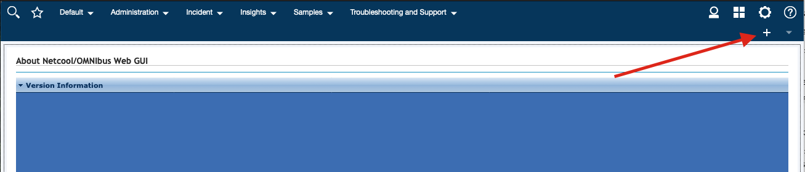

2. Set the page name and the menu location which you want the mapper page to appear in. In the optional setting add the ASM roles so that ASM users can access the mapper page. Click `OK` too continue.

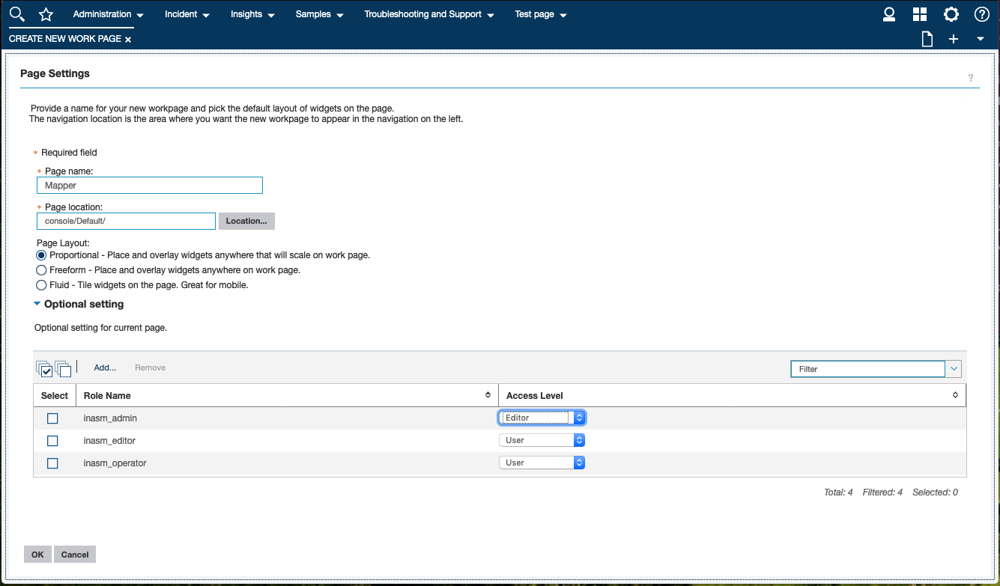

3. Search for `web widget` and draw the tile onto the page area. Resize to fill the whole page.

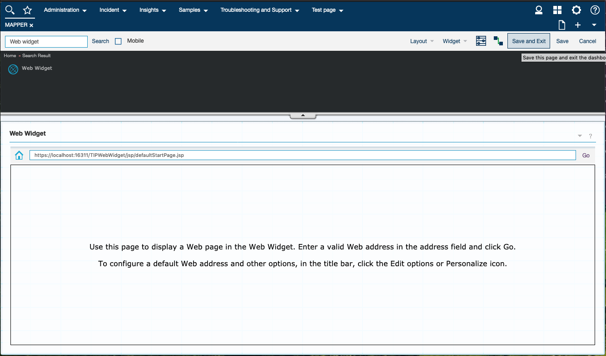

4. In top right click the down arrow to edit the page settings.

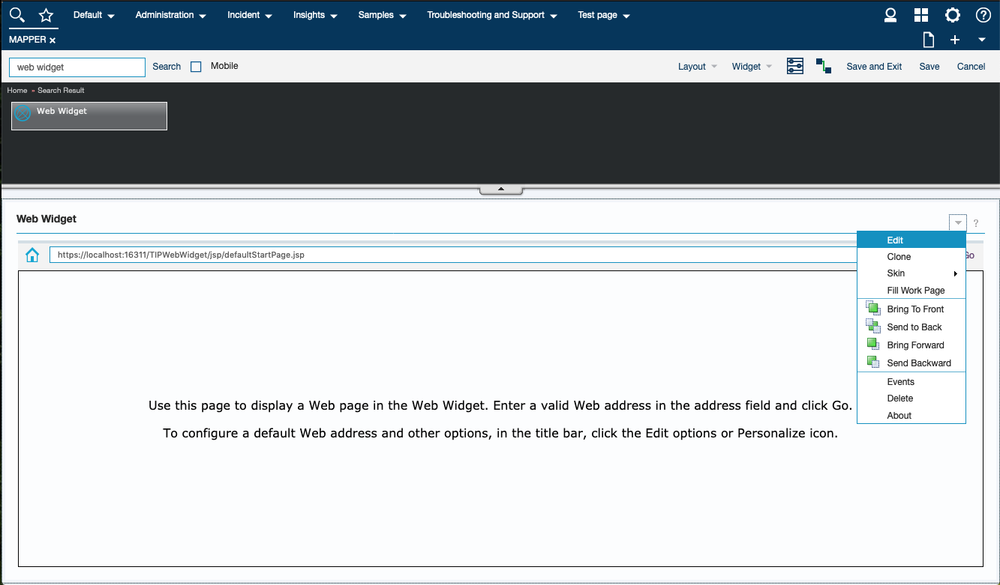

5. Set the title if you wish to have an addition title. Then set the homepage URL, this should match the topology mapper url and port. You can add additional url parameters here or in the app config. The deselect the `Show a browser toolbar` option and select save.

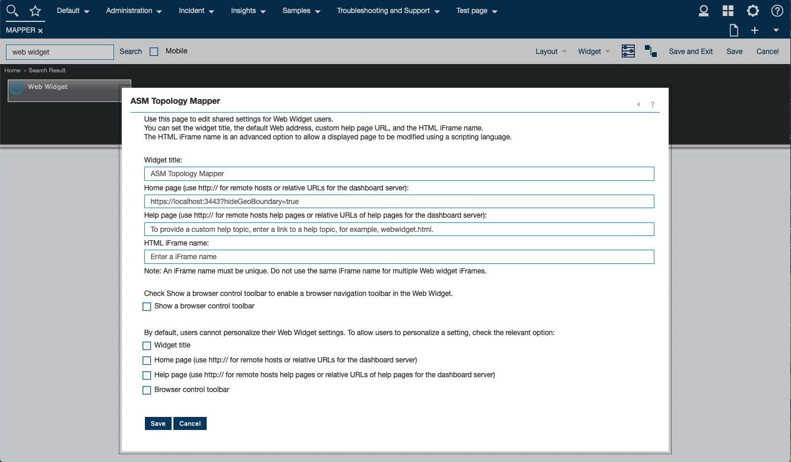

6. Finally click `Save and Exit` to store your changes and you should be able to access your mapper page.

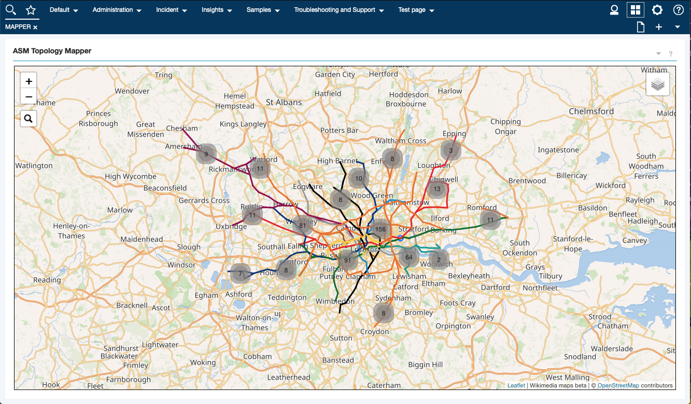

### Create mapper launch tool in ASM

You could use the options described in [URL options](#URL-options) to create a custom tool in ASM, using the following implementation. For more information on creating tools in ASM check out the [Knowledge Center](https://www.ibm.com/support/knowledgecenter/SS9LQB_1.1.7/Administering/t_asm_configuringcustomtools.html)
```js
//localhost:4000 is the host and port the mapper image is running on
window.open('http://localhost:3000/?resourceId=' + asmProperties._id);
```

## Features
### Location markers
Locations from ASM will be plotted on the map with a pin, that matched the latitude and longitude values supplied. This marker will also indicate the maximum state severity of the resource, such as 'critical'. Zooming out of the map will automatically cluster markers on the map to avoid cluttering the view when many locations are present. The images below show examples of the marker and the clustering effect.

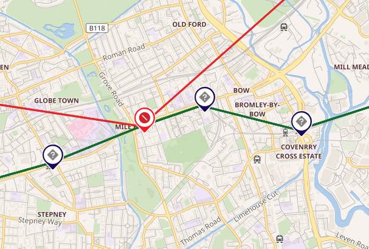
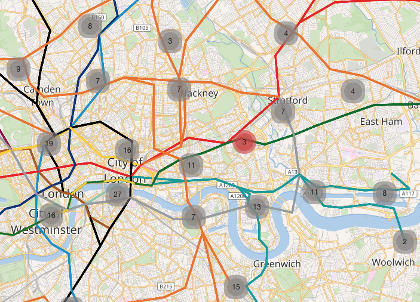
### Tooltip
Hovering the mouse over a marker will cause a tooltip to appear showing basic information about the resource. This tooltip can be customised to include other properties that are useful to have quick access too. These extra tooltip properties can be added via the URL following the steps indicated in [URL options](#URL-options), or can be applied to the app configuration at start time with the configuration parameter `TOOLTIP_PROPERTIES or tooltipProperties`. Below shows an example of this tooltip with the addition property zone included.

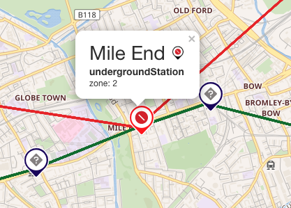

### Info popup table
Clicking on a location marker loads a table with a complete set of properties of the selected resource. This is fetched directly from ASM each time and includes the status information associated with the resource. It is possible to hide certain properties from this popup using the configuration parameter `POPUP_IGNORE_PROPERTIES or popupIgnoreProperties`. The popup also includes a URL link back into the ASM UI which the data was pulled, clicking the link will load the ASM UI in context with that location resource. Below shows an example of this popup.

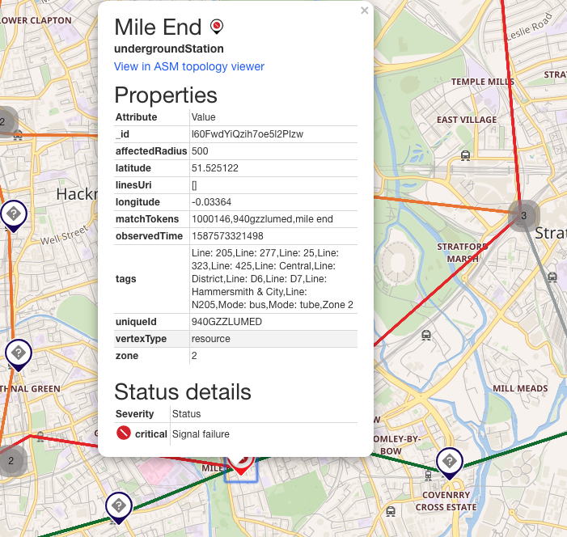


### Search
On the top left of the map, users can search of locations and this will zoom to the correct position on the map when selected.

### Layer filtering
On the top right of the map, users can choose to filter certain layers of the map to be on or off. This allows the map to be focused on the important locations for a specific task.

### Relationship links
Relationships between resources can be pulled from ASM using the configuration parameter `LINK_TYPES or linkEdgeTypes`. These relationships will be shown on the map via a line if both end of the link are present on the map. The colouring of the link can be set using the configuration parameter `LINK_COLOR_PROPS or linkColorPropertyNames` which it will use if present on the relationship.

### Geo Boundary
This is a new experimental feature, allow geographical areas to be drawn on the map. This requires the boundary definition to be supplied using the format suggested in the latlng specification described in
https://leafletjs.com/reference-1.6.0.html#polygon. You can identify the resource types in ASM which are boundaries using the configuration parameter  `BOUNDARY_TYPES or boundaryEntityTypes` and you will also need to set the parameter name that hold the boundary definition. This is set using the configuration parameter `BOUNDARY_PROPS or boundaryPropertyNames`. Below is an example of this being applied to the map you will notice that the colouring matches the maximal severity colouring.

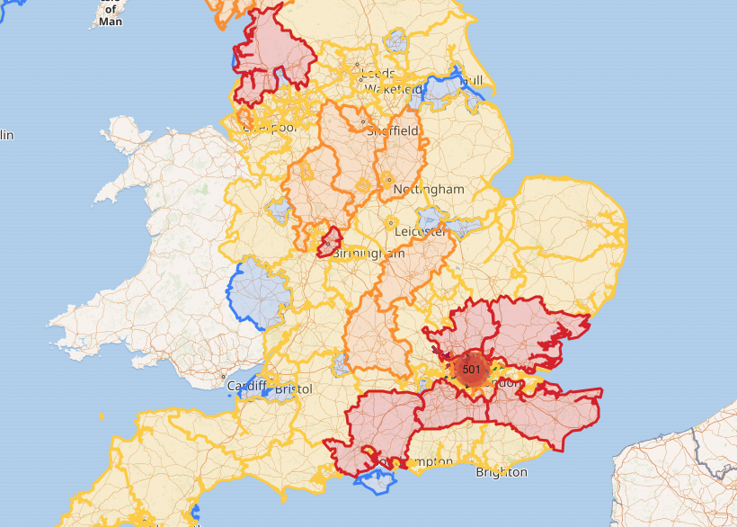

### Affected radius
This is a new experimental feature, to allow you to add an affect radius in metres to a given resource location. This will automatically apply the affect radius if the property provided of the location has a valid value. To set this property us the configuration parameter `AFFECTED_RADIUS_PROPS or affectedRadiusPropertyNames`. Below is an example of the radius being applied, you will notice that the colouring matches the maximal severity colouring.

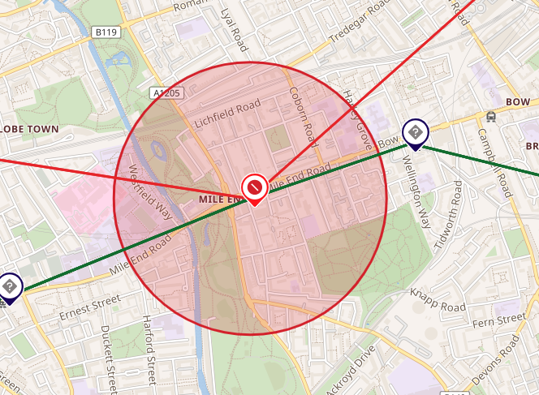


### Weather layers
Weather layers can be added to the map using the [OpenWeather API](https://openweathermap.org). In order to use the weather map layers you must first get a API key from OpenWeather, go to the following link [https://openweathermap.org/appid](https://openweathermap.org/appid). Once you have this you can use the API key or appid as it is called in openWeather to add the layer dynamically to the map via the url parameter `openWeatherMapApiId`.